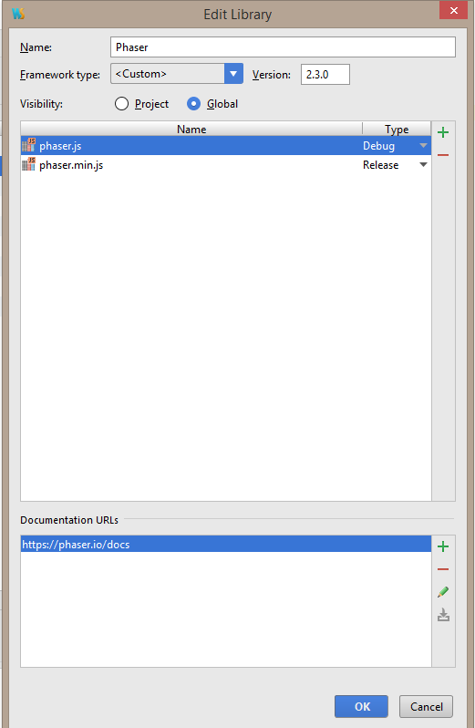

# SP2015_TD
Softwarepraktikum 2015 Tower Defense

#### Note: This is a WebStorm-Project.

You have to configure your external libraries inside your WebStorm IDE as the following:

Under `Settings -> Languages & Frameworks -> JavaScript -> Libraries` select `Add...` with the following options:

The name must be the same. We use phaser version 2.3.0

For **jQuery** use the `Download...` functionality for the libraries (it is the jQuery version 2.0.0).